# Debate Convergence Root Cause

## Audit conclusion

Live software runs (roommate expense splitting, study-group matching, church donation) failed with `cap_reached` despite unused turn budget. The export labeled every such exit as “Turn limit reached,” but Study stopped after Backend’s correction slots were exhausted and Church stopped on the DevOps equivalent path.

The structural root cause was **distributed closure authority**:

- `runDebateLoop`, linear progression, `resolveReviewerOutcome`, correction validation, architect quality gates, and ops follow-up could each schedule more work or emit `cap_reached`.
- No module owned a monotonic path to `approved`.
- The reviewer contract was open-ended: every re-review could invent new blockers.
- The issue ledger recycled concerns (`attempted` / `still_open`), and ops follow-up counted `attempted` as unresolved, so approval was blocked while issues never closed.

```mermaid
flowchart LR
  InitialTurns["Initial roles speak once"] --> InitialReview["One full review"]
  InitialReview --> IssueLedger["Typed issue ledger"]
  IssueLedger --> CorrectionWave["Bounded targeted correction wave"]
  CorrectionWave --> OpsClosure["DevOps addresses or accepts ops risks"]
  OpsClosure --> FinalReview["Scoped final review"]
  FinalReview --> FinalizeApproved["Deterministic Approved finalization"]
  FinalizeApproved --> AcceptedRisks["Explicit accepted-critical-risk metadata"]
```

## Redesign

`debate-convergence-controller.ts` is the only module that chooses the next phase and final outcome. Software/hybrid runs follow a 10-turn schedule. Issue statuses are monotonic (`open | addressed | accepted_risk`). Baseline issue IDs freeze after the initial review. Hitting reject/correction budgets advances to final review/finalization as `approved`, never normal `cap_reached`. Unresolved critical blockers become `acceptedCriticalRisks` while the outcome remains `approved`.

Abort, provider failure, and cost-budget failure remain typed operational errors.

## Acceptance signals

- Outcome `approved` within ≤10 software turns
- Zero open issues at approval (residuals are addressed or accepted_risk)
- ≤5 rejects, ≤3 corrections per role
- Peak prompt under control via summarization + section-dump caps
- `userWaitMs` = debate + artifact wall clock
- Export includes `finalization` metadata

## Live verification (2026-07-21)

| Scenario | Outcome | Turns | Debate | Peak prompt | Notes |
|----------|---------|-------|--------|-------------|-------|
| Roommate expense splitting | approved | 7 | ~5.6 min | 9.4k | Artifacts ready; userWait = debate+artifact |
| Study group matching | approved | 9 | ~7.2–7.6 min | 6.8–7.6k | Finalization present; artifact synthesis failed (roster only) — not `cap_reached` |
| Church food donation | approved | 9 | ~7.4 min | 9.3k | Artifacts ready 5/5; userWait correct |

Reject/correction budgets held (study: 2 rejects, ≤2 corrections/role). No normal `cap_reached` exits.